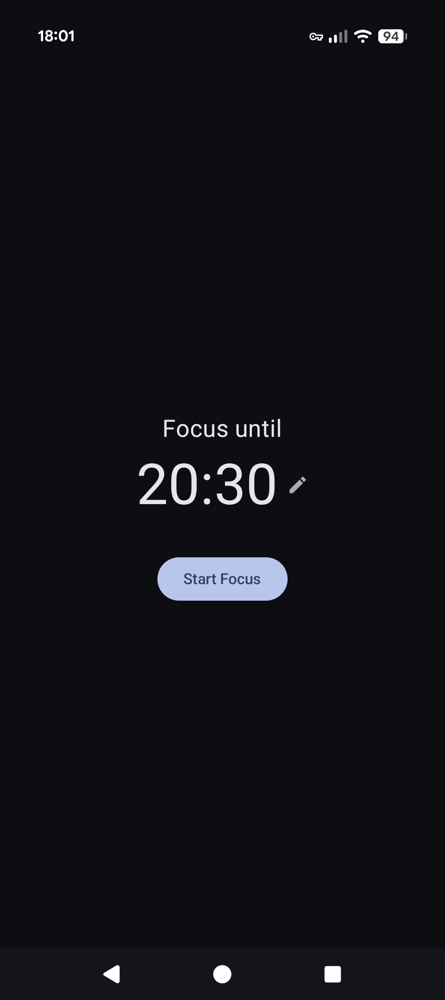

# Screenshots

# What does this app do?
This app is a Pomodoro-style focus timer designed to fit naturally into your workday.

# Features
## Session-first scheduling
Most Pomodoro apps are interval-first: start a 25-minute timer, manually start the next one, repeat. 

This app is session-first. You pick a session end time, and the app pre-plans the entire sequence: 25-minute focus blocks with 5-minute short breaks, and a 15-minute long break after every 2 short breaks. The final focus block is shortened to fit the end time exactly.

This means you can start a session knowing it will finish before your next meeting, without any manual management in between.

## Designed to help you focus
- **Distraction-free** - While a focus timer is active, the app runs in immersive mode, which hides all system bars. It also automatically enables Do Not Disturb, then turns it off when the focus session is over.
- **Music controls in app** - A minimal media control panel on the focus screen allows you to control your music without leaving the app. It controls whatever is currently playing via Android's notification listener.

# Technical Details
This app was build using Kotlin and Jetpack Compose.

## Libraries Used
[Kotlin Coroutines](https://kotlinlang.org/docs/coroutines-overview.html) + StateFlow/SharedFlow for state management.
 
[Android CountDownTimer](https://developer.android.com/reference/android/os/CountDownTimer) for the countdown logic.
 
[MediaSessionManager / NotificationListenerService](https://developer.android.com/reference/android/service/notification/NotificationListenerService) for media controls.